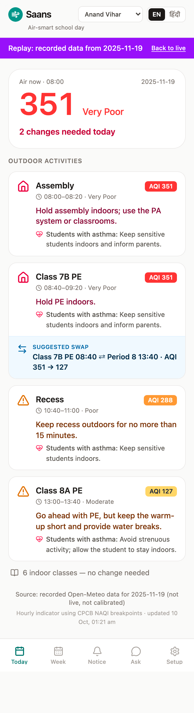
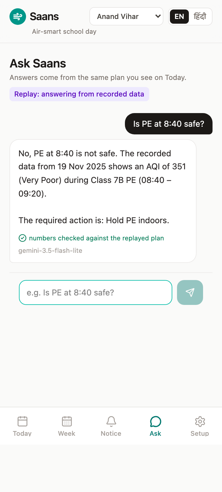
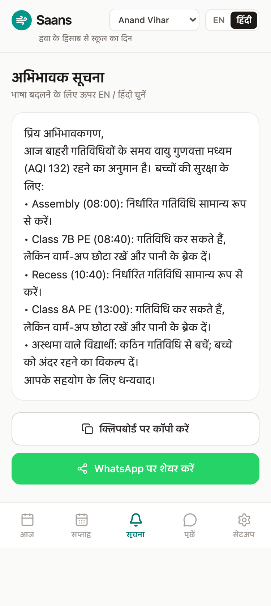
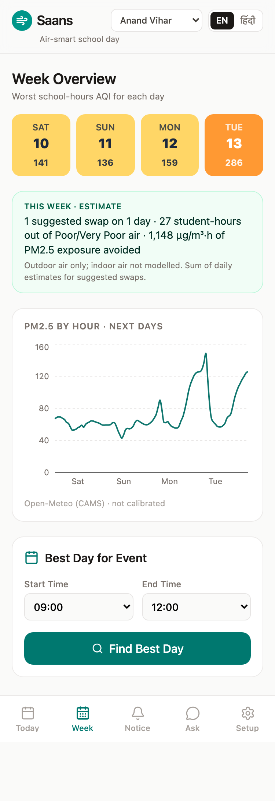
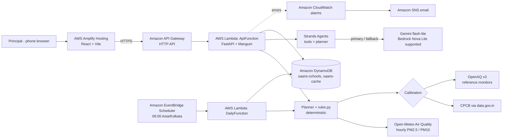

# Saans — AQI-smart timetables for schools

**Saans turns the hour-by-hour air-quality forecast into decisions for a school's actual timetable: which PE period to move, when to hold assembly indoors, and what to tell parents — in English and Hindi.**

*Environmental Hacks (WeMakeDevs × AWS, Bharat Builds Tour) · Track 01: Air — "School safety on bad days" · Team Chernobyl*

**Live app:** https://main.d6f34l6r9rpi9.amplifyapp.com  ·  **API:** https://qcx2qrt6bj.execute-api.us-east-1.amazonaws.com/api/health
**Try a bad-air day:** https://main.d6f34l6r9rpi9.amplifyapp.com/?replay=delhi-nov (recorded Delhi data, 19 Nov 2025)

---

## The problem

- **Children are the most exposed.** WHO's 2018 report *Air pollution and child health: prescribing clean air* found that 93% of the world's children live with air pollution above WHO guideline levels, and linked air pollution to respiratory infections that killed 543,000 children under five in 2016. ([WHO, 2018](https://www.who.int/publications/i/item/WHO-CED-PHE-18-01))
- **Short, bad days matter, not just annual averages.** A 2024 *Lancet Planetary Health* study of ten Indian cities (2008–2019) found that each 10 µg/m³ rise in two-day average PM2.5 was associated with 1.4% higher daily mortality, and attributed 7.2% of daily deaths to PM2.5 above the WHO guideline. ([de Bont et al., 2024, doi:10.1016/S2542-5196(24)00114-1](https://pmc.ncbi.nlm.nih.gov/articles/PMC11774940/))
- **Schools only get blunt tools.** On 17 Nov 2024 Delhi's AQI hit 441 (Severe), GRAP Stage IV was invoked and physical classes were suspended across Delhi-NCR. ([ETV Bharat](https://www.etvbharat.com/en/!bharat/delhi-air-quality-atishi-school-classes-grap-stage-4-caqm-aqi-monday-enn24111800016), [SCC Online on the Supreme Court order](https://www.scconline.com/blog/?p=335496)) Between "normal day" and "school closed" there is nothing that tells a principal what to do with *period 2*.
- **Air changes hour by hour.** In Delhi's winter, PM2.5 builds up overnight under a shallow mixing layer and falls as it rises after sunrise. ([Murthy et al., 2020, doi:10.1016/j.jastp.2019.105157](https://doi.org/10.1016/j.jastp.2019.105157)) A PE class at 08:40 and one at 13:40 can face very different air — on our recorded day, AQI 351 vs 127.

## What Saans does

1. **Today** — for each outdoor period (assembly, PE, recess, sports) Saans shows the forecast AQI, the band, and a deterministic action: go, caution, or indoors. A one-line verdict ("2 changes needed today") sits under a large AQI number.
2. **Swaps** — when a period must not run outdoors, Saans suggests exchanging it with an indoor class later the same day: *Class 7B PE 08:40 ⇄ Period 8 13:40 · AQI 351 → 127*. Smaller improvements appear as a grey "better slot available".
3. **Students with asthma** — a separate, stricter action for sensitive students (a count only; no names or health records).
4. **Parent notice** — EN/HI text built from the plan, shared with one tap via a WhatsApp link.
5. **Week & best day** — worst school-hours AQI per day and a ranked "best day for Sports Day 09:00–12:00".
6. **Ask Saans** — a Strands agent answers questions like "Is PE at 8:40 safe?" by calling the same planner tools; every number in its answer is checked against those tool outputs.
7. **Daily 06:00 IST run** — EventBridge Scheduler precomputes every school's plan, so the principal's screen is ready before school.

| Today (replay) | Ask | Parent notice (HI) | Week |
|---|---|---|---|
|  |  |  |  |

More: [Today (live)](docs/img/today-live.png) · [Today in Hindi](docs/img/today-hi.png) · [Notice EN](docs/img/notice-en.png) · [Ask, waiting](docs/img/ask-waiting.png) · [Setup](docs/img/setup.png)

## Architecture



### What runs on AWS

Everything that serves a request or runs on a schedule runs in our AWS account, defined in one SAM template: **2 Lambda functions, 1 HTTP API, 2 DynamoDB tables, 1 EventBridge schedule, 2 CloudWatch alarms, 1 SNS topic**, plus Amplify Hosting for the frontend. The agent is built with **Strands Agents (AWS open source)**. Only two things are outside AWS: the air-quality data providers (Open-Meteo, CPCB/OpenAQ) and — because Bedrock access was blocked on our account — the LLM, which Strands lets us point at Bedrock with one setting (`MODEL_PROVIDER=bedrock`).

### AWS services and why

| Service | Used for | Why |
|---|---|---|
| **AWS Lambda** | `ApiFunction` (FastAPI via Mangum) and `DailyFunction` (06:00 job) | Traffic is a few school mornings a day; pay per request, no servers to babysit. |
| **Amazon API Gateway (HTTP API)** | Public HTTPS API with CORS | Cheapest, simplest front door for Lambda. |
| **Amazon DynamoDB** | `saans-schools` (profiles, timetables) and `saans-cache` (precomputed daily plans, key `school_id#date`) | Key-value access, on-demand billing, no capacity planning. |
| **Amazon EventBridge Scheduler** | `cron(0 6 * * ? *)` in `Asia/Kolkata` | Native time-zone support, so "06:00 IST" means 06:00 IST. |
| **Amazon CloudWatch + Amazon SNS** | Alarms on Lambda errors (≥ 5 in 5 min) → email | We find out before a principal does. |
| **AWS Amplify Hosting** | React frontend, rebuilt on every push to `main` | Git-connected CI/CD and HTTPS with zero config. |
| **AWS SAM** | Whole backend as code (`backend/template.yaml`) | One `sam deploy`; secrets as NoEcho parameters. |
| **Strands Agents** (AWS open source) | The Ask agent and its tools | Model-agnostic: the same agent runs on Bedrock or Gemini. |
| **Amazon Bedrock** (Nova Lite) | Supported model provider (`MODEL_PROVIDER=bedrock`) | Our default design; see limitations for why the live demo uses Gemini. |

## The science

### 1. NAQI from concentrations
India's National AQI (CPCB) maps each pollutant to a sub-index by linear interpolation within its band; AQI = max(sub-indices), capped at 500. ([CPCB 2014 breakpoints, reproduced in PMC7397983](https://pmc.ncbi.nlm.nih.gov/articles/PMC7397983/table/table-1))

| AQI | Band | PM2.5 (µg/m³) | PM10 (µg/m³) |
|---|---|---|---|
| 0–50 | Good | 0–30 | 0–50 |
| 51–100 | Satisfactory | 31–60 | 51–100 |
| 101–200 | Moderate | 61–90 | 101–250 |
| 201–300 | Poor | 91–120 | 251–350 |
| 301–400 | Very Poor | 121–250 | 351–430 |
| 401–500 | Severe | 250+ | 430+ |

The published table has integer gaps (60 → 61). Forecasts are decimals, so Saans treats bands as contiguous and clamps each sub-index to its band's top — PM2.5 60.9 is Satisfactory, never "Severe" (this was a real bug; see the blog). Above the cap the UI shows **500+** and the concentration that is off the scale.

### 2. Calibration — only against reference monitors, only when fresh
- Forecast: Open-Meteo Air Quality (CAMS model), hourly PM2.5/PM10 for the school's coordinates.
- Observation chain: **CPCB via data.gov.in → OpenAQ v3 reference monitors (CPCB preferred) → uncalibrated.** Low-cost sensors are never used.
- Used only if the station is ≤ 25 km away and its reading is < 2 h old.
- `ratio = clip(observed / forecast_now, 0.5, 2.0)`, anchored on the current IST hour; `factor(h) = 1 + (ratio − 1)·e^(−|h|/12)`.
- Otherwise the forecast is shown **uncalibrated, with the reason** (e.g. "nearest CPCB monitor via OpenAQ last reported 50 h ago").

### 3. School protocol (`rules.py`) — deterministic, every cell tested
Based on CPCB health-advisory categories; the school thresholds are Saans' own conservative design.

| Band | High-intensity outdoor (PE, sports) | Low-intensity outdoor (assembly, recess) | Students with asthma |
|---|---|---|---|
| Good / Satisfactory | Go | Go | Normal; inhaler available |
| Moderate | Caution: short warm-up, water breaks | Go | Avoid strenuous; may stay in |
| Poor | **Indoors** or swap | Caution: ≤ 15 min | **Indoors** |
| Very Poor | **Indoors** | **Indoors** (PA system / classrooms) | Indoors; inform parents |
| Severe | **Indoors** | **Indoors**; follow GRAP directives | Indoors; escalate |

Indoor classes always get "no change needed". A period with no forecast data is **never** shown as safe ("No data", caution).

### 4. Exchange swaps
Only outdoor periods marked swappable can move, and only by **exchanging** with an indoor, swappable class period the same day (08:00–15:00) whose hours give the activity a better action. Greedy, worst period first, each target used once. `indoors` → target must give go/caution; `caution` → target must give go (shown as an optional "better slot"). The parent notice *offers* swaps ("Hold PE indoors, or move it to 13:40"); it never announces them as done.

### 5. Number guard
The LLM never decides safety. After the agent answers, every number ≥ 20 in the answer must appear in that request's tool outputs, the question, or the school profile. If not, the API logs a warning and returns the deterministic plan summary instead. The UI shows "✓ numbers checked" only when the check passed.

### 6. Model fallback chain
Primary `gemini-3.5-flash-lite` → fallback `gemini-3.1-flash-lite` → deterministic plan summary. Retries on 503/429/timeouts with 0.5 s / 1.5 s backoff, only while the 24 s budget still leaves room for the next model; each call has a 10 s deadline (Gemini's minimum). The response names the model that answered.

## Honest limitations

- **Hourly indicator, not official NAQI.** NAQI is defined on 24-hour averages; Saans applies the same breakpoints to hourly values as an exposure indicator and says so in the UI.
- **Forecast uncertainty.** Saans relies on a global model forecast (CAMS via Open-Meteo); we did not find a published Delhi-specific validation of its hourly PM2.5, so treat hourly values as guidance. Calibration helps only when a fresh reference reading exists.
- **Stale reference data.** From AWS, data.gov.in refuses connections, and during our build OpenAQ's CPCB feed was ~50 h behind, so the live app is often **uncalibrated** — and labels itself so.
- **Bedrock was blocked on our account,** so the live demo uses Gemini through the same Strands agent. Bedrock Nova Lite remains supported (`MODEL_PROVIDER=bedrock`).
- **School thresholds are a design, not a medical guideline.** Swaps are suggestions; the principal decides.
- Demo schools and timetables are seeded examples and are **read-only** on the public API (Setup saves a new school instead), so the demo cannot be overwritten.
- Live calibration is rarely visible right now (data.gov.in blocks AWS; OpenAQ's CPCB feed is stale). The calibration maths is covered by unit tests (`backend/tests/test_calibrate.py`).

## Run locally

```bash
python3.12 -m venv .venv && .venv/bin/pip install -r backend/requirements.txt
cd backend && ../.venv/bin/python -m pytest -q          # 160+ tests
../.venv/bin/uvicorn app:app --reload                    # http://localhost:8000/api/health
cd ../frontend && npm install && npm test && VITE_API_URL=http://localhost:8000 npm run dev
```
Without keys the backend still runs: forecasts fall back to labelled fixtures and Ask returns the deterministic plan summary.

## Deploy

```bash
cd backend
sam build --use-container
sam deploy --stack-name saans --resolve-s3 --capabilities CAPABILITY_IAM --region us-east-1 --no-confirm-changeset \
  --parameter-overrides DataGovInApiKey=$DATA_GOV_IN_API_KEY ModelProvider=gemini \
  GeminiModelId=gemini-3.5-flash-lite GeminiFallbackModelId=gemini-3.1-flash-lite GeminiApiKey=$GEMINI_API_KEY \
  OpenAqApiKey=$OPENAQ_API_KEY AlertEmail=you@example.com
AWS_DEFAULT_REGION=us-east-1 STORE=dynamo ../.venv/bin/python scripts/seed_dynamo.py saans-schools
```
Frontend: Amplify app connected to this repo builds `frontend/` on every push; `frontend/.env.production` holds the public API URL. Screenshots: `cd frontend && npm run shots`.

## Team

**Team Chernobyl** — Arnav Gupta (lead), Avishi.
Built with several AI coding agents taking turns; `AGENTS.md` and `docs/STATE.md` are the shared memory and decision log.
